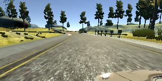
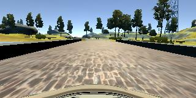
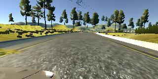
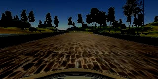
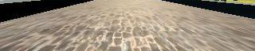

# Behavioral Cloning Project

The Project
---
The goals / steps of this project are the following:
* Use the simulator to collect data of good driving behavior
* Build, a convolution neural network in Keras that predicts steering angles from images
* Train and validate the model with a training and validation set
* Test that the model successfully drives around track one without leaving the road
* Summarize the results with a written report

### Dependencies
This lab requires:

The following resources can be found in this github repository:
* drive.py
* video.py
* writeup_template.md

The simulator that was used to collect training data, and test our model can be found here https://github.com/udacity/self-driving-car-sim.

## 1. Data preprocessing

The images used in testing and validation set were the default ones provided by the project plus the extended dataset2 which contained special cases during driving (cases when going outside of lane on right and left side in order to teach NN how to steer back, and the most troublesome point on mao when passing the bridge.)

Below we can see three types of images taken from left, center and right camera on the car.

Left camera             |  Center camera            | Right camera
:-------------------------:|:-------------------------:|:-------------------------:
  |    |  

While using the provided dataset augmentation on dataset was used (adding additional images by flipping existing), but since the dataset was extended with additional data, that was not needed.

The network has two layers that preprocess incoming images;

1. Image Normalization:

2. Image cropping

## 2. Solution Design Approach

The overall strategy for deriving a model architecture was to construct first end to end solution and to upgrade it from there.

My first step was to use a convolution neural network model with just two layer, adn that shoed terrible results, and that why I decided to use one of the existing models, LeNet-5 model.

In order to gauge how well the model was working, I split my image and steering angle data into a training and validation set. I found that my first model had a low mean squared error on the training set but a high mean squared error on the validation set. This implied that the model was overfitting.

To combat the overfitting, I modified the LeNet-5 model with Dropout layers.

Then I noticed that the NN was not behaving good on bridge, and then I decided to extend the dataset with my own driving data, in which I recorded the specific mistakes that the model made when approaching edges of the bridge.

At the end of the process, the vehicle is able to drive autonomously around the track without leaving the road.

## 3. Final Model Architecture

My model consists of the following layers:
 1. Input layer that standardizes image.
 2. Layer that crops the image.
 3. 2x Convolutional layers with Dropouts layers
 4. 3x Convolutional layers
 5. 4x Fully connected layers

This resembles LeNet-5 architecture.
During training the network showed signs of overfitting and therefore the dropout layer were applied to the two Convolutional layers.
The model used an adam optimizer, so the learning rate was not tuned manually.

## 4. Creation of the Training Set & Training Process

I have sued the provided dataset in conjunction with my own.
Provided dataset contained 24108, and my own 7266 images, which makes in total 31374 images.

The provided dataset worked ok on tha track, but the problem was when coming on the bridge, the the car would crash on the edge, adn could not move. I have recorded few images showing how car avoid the crash with bridge edge, and then I have also recorded a full lap around the track.
